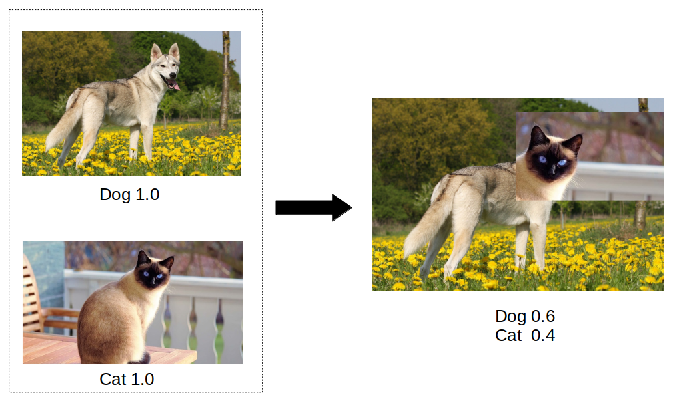
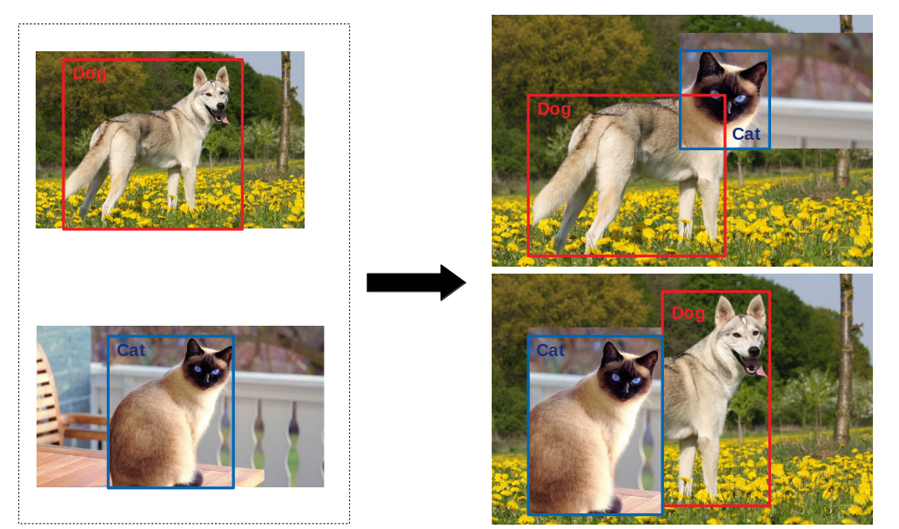

[](https://travis-ci.com/TheDenk/augmixations)
[](https://codecov.io/github/TheDenk/augmixations?branch=master)
[](https://lbesson.mit-license.org/)
[](https://shields.io/)

# augmixations
Some augmentation for object detection.  
Current augmentations:  
  - cutmix (<a href="https://github.com/TheDenk/augmixations/blob/master/examples/cutmix_example.ipynb">Colab Example</a>)   

In progress:  
  - mozaic  
  - gridmask  
  - mixin
   
## Cutmix  
### Default Cutmix for classifiers
<p>
 
</p>  
<p>  Paper: <a href="https://arxiv.org/abs/1905.04899">https://arxiv.org/abs/1905.04899</a> </p>

### Current cutmix
<p>
 
</p> 

## Getting Started
    pip install augmixations  

### Example with default parameters  


  Import:  
```python
from augmixations import cutmix  
```
  Using:  
```python
#  bg_img - The image into which a rectangle will be inserted  
#  fg_img - The image from which a random rectangle will be cut 
img, boxes, labels = cutmix(bg_img, bg_boxes, bg_labels,
                            fg_img, fg_boxes, fg_labels)  
```
  Done.
 
## Advansed usage 

<p>You can pass special configs to the cutmix function to override its behavior.</p>   
<a href="https://github.com/TheDenk/augmixations/wiki/Cutmix-Advanced-Usage"><p>Cutmix Advanced Usage</p></a>  
 

## Contacts
<p>Issues should be raised directly in the repository. For professional support and recommendations please <a>komedian@bk.ru</a>.</p>
  
  
