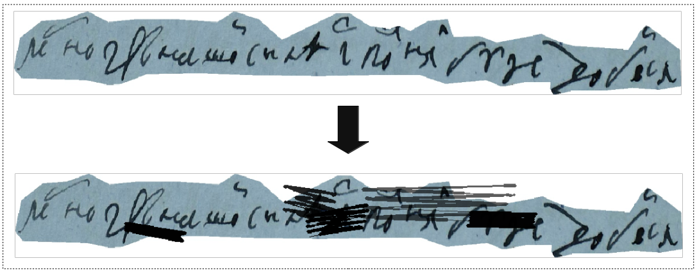

[](https://travis-ci.com/TheDenk/augmixations)
[](https://codecov.io/github/TheDenk/augmixations?branch=master)
[](https://lbesson.mit-license.org/)
[](https://shields.io/)

# augmixations
Some augmentations that I hasn't found in other repositories and libraries.  
  
<h3 style="color:#ff5555">Warning:</h3> This library does not install all dependencies for each augmentation. I wrote dependencies in each description and you should install it by yourself.  

Also I marked installed libraries in <b style="color:#55ff55">green</b> and not installed in <b style="color:#ff5555">red</b>.  
  
For more details you can see the <a href="">wiki</a> page of this repo.  


Current augmentations:  
  - cutmix (<a href="https://github.com/TheDenk/augmixations/blob/master/examples/cutmix_example.ipynb">Colab Example</a>, <a href="https://github.com/TheDenk/augmixations/wiki/Cutmix-Advanced-Usage">Advanced Usage</a>)  
  - hand written blots (<a href="">Colab Example</a>, <a href="">Advanced Usage</a>)  

In progress:  
  - mozaic (object detection)  
  - gridmask (object detection)  
  - mixin (object detection)  
   
## Cutmix  
#### Dependencies  

  - <b style="color:#55ff55">numpy>=1.11.1</b>  
  
<p>
 
</p> 

## Handwritten Blots
#### Dependencies  

```diff
+ numpy>=1.11.1
- bezier==2020.5.19
- opencv-python>=4.1.1
```
<p>
 
</p> 

## Getting Started
    pip install augmixations  

### Example with default parameters  


  Import:  
```python
from augmixations import Сutmix  
```
  Using:  
```python
#  bg_img - The image into which a rectangle will be inserted  
#  fg_img - The image from which a random rectangle will be cut 
cutmix = Cutmix()
img, boxes, labels = cutmix(bg_img, bg_boxes, bg_labels,
                            fg_img, fg_boxes, fg_labels)  
```
  Done.
 
## Advansed usage 

<p>You can pass special configs to the cutmix function to override its behavior.</p>   
<a href="https://github.com/TheDenk/augmixations/wiki/Cutmix-Advanced-Usage"><p>Cutmix Advanced Usage</p></a>  
<a href=""><p>Blots Advanced Usage</p></a>  

## Contacts
<p>Issues should be raised directly in the repository. For professional support and recommendations please <a>komedian@bk.ru</a>.</p>
  
  
